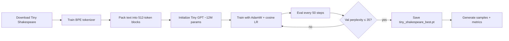

# Tiny Shakespeare training run — what happened

This document explains the **Phase 7** end-to-end training run: Tiny GPT on Karpathy’s
Tiny Shakespeare corpus. It is written for someone who wants to understand the pipeline,
the numbers, and the artifacts without reading all the code.

**Canonical run:** `experiments/experiment_004/`  
**Best weights:** `experiments/experiment_004/tiny_shakespeare_best.pt`  
**Config used:** `configs/tiny.yaml` (copied into the experiment folder as `config.yaml`)

---

## What we were trying to do

Train a small GPT **from scratch** (tokenizer → data → model → trainer → generation) on
~1 MB of Shakespeare text and prove the stack works:

- validation perplexity reaches a reasonable target on held-out text
- generated samples look like English / Shakespeare, not random tokens
- the model is not just copying long spans from training data verbatim

This is **not** a chat model. It learns to **continue text** in the style of the corpus.

---

## End-to-end pipeline



**Command that produced the successful run:**

```bash
make train
# equivalent:
python scripts/train.py --config configs/tiny.yaml
```

---

## 1. Data

| Item | Value |
|------|--------|
| Source | [Karpathy Tiny Shakespeare](https://github.com/karpathy/char-rnn/blob/master/data/tinyshakespeare/input.txt) |
| Local path | `data/shakespeare/` (`input.txt`, `train.txt`, `val.txt`) |
| Train / val split | 90% / 10% by character count |
| Train sequences | 834 packed blocks |
| Val sequences | 100 packed blocks |
| Context length | 512 tokens per block |

Each training example is a **contiguous chunk** of tokenized Shakespeare. The model predicts
the next token at every position in the chunk (standard language modeling).

---

## 2. Tokenizer

| Item | Value |
|------|--------|
| Type | Byte-level BPE (built in-repo, Phase 2) |
| Vocab size | 4096 (+ 12 special tokens) |
| Trained on | Training split only |
| Saved to | `experiments/experiment_004/tokenizer/` |

The tokenizer is trained once and cached under `data/shakespeare/tokenizer/` for reruns.

---

## 3. Model (Tiny tier)

Settings from `configs/tiny.yaml`:

| Hyperparameter | Value |
|----------------|--------|
| Layers | 6 |
| Heads | 6 |
| `d_model` | 384 |
| Context | 512 |
| Architecture | Decoder-only, RoPE, RMSNorm, SwiGLU, weight tying |
| Dropout | 0.1 (final successful run) |
| **Parameter count** | **12.19M** (slightly above ~10M because vocab 4096 adds embedding params) |

**Important fix during development:** default PyTorch weight init produced logits so large
that initial loss was ~360 nats instead of ~8. GPT-2-style init (`std=0.02`) was added in
`model/gpt.py` before the successful run. Without this, training looked broken even though
the code was correct.

---

## 4. Training setup

| Setting | Value |
|---------|--------|
| Optimizer | AdamW (`lr=3e-4`, `weight_decay=0.05`) |
| Scheduler | Cosine decay with 100-step warmup |
| Batch size | 16 (effective 32 with `grad_accum_steps=2`) |
| Max steps | 1500 (stopped earlier — see below) |
| Precision | bfloat16 on Apple MPS when available |
| Eval interval | Every 50 steps |
| Early stop | Stop when val perplexity ≤ **35.0** |
| Patience | 200 steps without val improvement (backup stop; not triggered on final run) |
| Seed | 42 (reproducible) |

**Loss:** masked cross-entropy over all non-padding next-token positions.  
**Perplexity:** `exp(eval_loss)` — lower is better. Random guessing over 4096 tokens ≈ 8.3 nats
( perplexity ≈ 4096 ).

---

## 5. What happened during training (loss curve)

Validation was run every 50 steps. Key milestones from `loss.csv` and logs:

| Step | Train loss (approx) | Val loss | Val perplexity |
|------|---------------------|----------|----------------|
| 50 | 5.01 | 5.27 | **195** |
| 100 | 4.11 | 4.40 | **81** |
| 150 | 3.79 | 4.12 | **62** |
| 200 | 3.62 | 3.92 | **51** |
| 250 | 3.52 | 3.78 | **44** |
| 300 | 3.35 | 3.68 | **40** |
| 350 | 3.23 | 3.60 | **37** |
| **400** | ~3.1 | **3.53** | **34.12** ✓ target met |

At **step 400**, validation perplexity **34.12** dropped below the target **35.0**, so
training **stopped early** (success gate). The best checkpoint was saved as
`tiny_shakespeare_best.pt`.

Earlier failed/partial runs (experiments 001–003) taught us:

- bad init → loss stuck in hundreds
- no early stopping → overfitting after ~450 steps (train loss kept falling, val perplexity rose)
- checkpoint RNG bug on MPS → fixed in `training/checkpoint.py`

---

## 6. Final results

From `experiments/experiment_004/metrics.json`:

| Metric | Value |
|--------|--------|
| Best step | 400 |
| Best val loss | 3.53 |
| Best val perplexity | **34.12** |
| Target | 35.0 — **passed** |
| Memorization spot-check | No long verbatim spans in sample outputs |

### Sample quality (honest assessment)

- **Good:** Character names (`ROMEO`, `DUKE VINCENTIO`), blank-verse rhythm, clearly English.
- **Weak:** Grammar errors, repetition loops at temperature 0.0, invented words (`divpette`,
  `suffervenangnow`). Expected for a 12M model on one tiny corpus.

Greedy decoding (`temperature=0.0`) often **repeats**; **temperature ~0.7** usually looks
more natural. See `experiments/experiment_004/samples.txt` for full outputs at 0.0, 0.7, 1.0.

---

## 7. Artifacts in `experiments/experiment_004/`

| File | Purpose |
|------|---------|
| `config.yaml` | Exact config snapshot for this run |
| `loss.csv` | Step-by-step train loss; eval loss every 50 steps |
| `metrics.json` | Final numbers + memorization check |
| `samples.txt` | Generated text at multiple temperatures |
| `tokenizer/` | BPE vocab for this run |
| **`tiny_shakespeare_best.pt`** | **Use this** — best validation weights (step 400) |
| `tiny_shakespeare.pt` | Final export (same weights after restoring best) |

Naming convention for future runs: `{experiment.name}_best.pt` and `{experiment.name}.pt`
(from `experiment.name` in the YAML, here `tiny_shakespeare`).

---

## 8. How to test the model

**CLI:**

```bash
python scripts/generate.py \
  --checkpoint experiments/experiment_004/tiny_shakespeare_best.pt \
  --tokenizer experiments/experiment_004/tokenizer \
  --prompt "ROMEO:\n" \
  --temperature 0.7
```

**Streamlit playground:**

```bash
make app
# opens app/playground.py — defaults point at experiment_004 weights
```

Use Shakespeare-style prompts (`CHARACTER:\n` or a line of verse). Plain questions like
“What is philosophy?” will not work well — the model was never trained for Q&A.

---

## 9. How to retrain

```bash
make train
# or with explicit config:
make train CONFIG=configs/tiny.yaml
```

Each run creates a new folder: `experiments/experiment_005/`, etc. Edit `configs/tiny.yaml`
to change hyperparameters; do not change `vocab_size` after the tokenizer is fixed without
re-tokenizing the corpus.

---

## 10. What comes next (not this run)

This checkpoint is a **foundation milestone** (Phase 7). Later phases add:

- general pretraining on larger corpora (TinyStories, WikiText, …)
- philosophy / VERITAS datasets and DPO alignment
- production chat UI and API

The Shakespeare model is the first proof that training, checkpoints, and generation all work
together in this repo.
